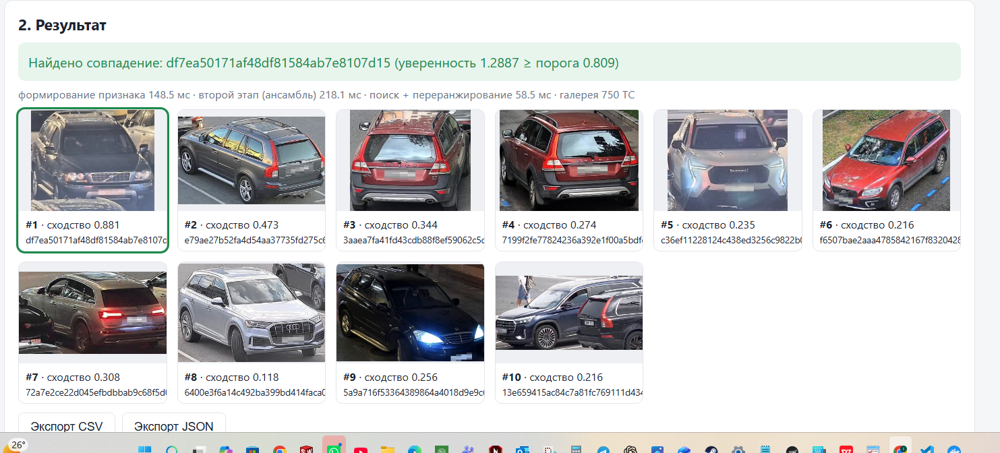
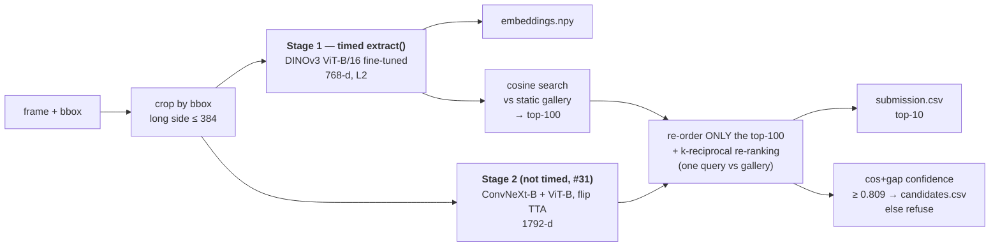
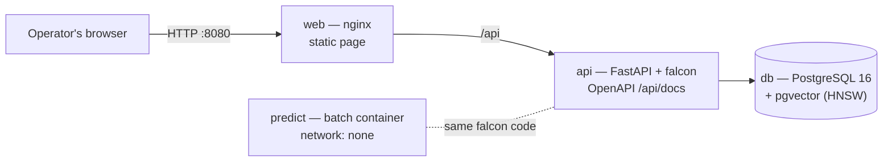

# Falcon ReID — vehicle re-identification without licence plates

**ЛЦТ 2026 · Task 7 «ФАЛЬКОН.Tech»** — a service that builds a visual "digital fingerprint" of a vehicle
and finds the same physical car in photos from other cameras, **without using the licence plate**.
It ranks the gallery for every query and **refuses** ("no confident match") when the car is not there.

> **Кратко (RU).** Сервис формирует цифровой признак ТС по кропу из рамки BBox и ищет тот же автомобиль
> на снимках с других камер без использования госномера. Двухэтапный поиск: быстрая модель DINOv3 ViT-B/16
> (замеряемая функция `extract()`, ≈27 мс на ТС) отбирает топ-100 кандидатов, ансамбль ConvNeXt-B + ViT-B
> переупорядочивает только их, затем k-reciprocal re-ranking одного запроса относительно статичной галереи.
> Режим отказа: сигнал cos+gap, порог 0.809 обоснован на двух независимых валидационных сплитах.
> Валидация (300 скрытых машин, официальный `evaluate.py`): **mAP@10 82.25 / 80.29**, 0.7·F1+0.3·TNR = 0.967.
> Запуск одной командой в Docker без интернета, веса — в GitHub Release с проверкой sha256.

---

## Results at a glance

All numbers are **measured**, with the organizers' unmodified `evaluate.py`, on two independent validation
splits of `train.csv` (300 held-out cars each, never seen in training; details in [Validation](#validation-protocol)).

| Metric (final pipeline) | Split 42 | Split 7 |
|---|---|---|
| **mAP@10** (main metric, 45%) | **82.25** | **80.29** |
| Rank-1 / Rank-5 | 78.11 / 93.99 | 75.77 / 92.26 |
| Refusal: F1 / TNR at threshold 0.809 | 0.955 / 0.994 | 0.963 / 0.974 |
| **0.7·F1 + 0.3·TNR** (10%), re-weighted to the closed test's 20% open-set | **0.967** | **0.967** |
| PR-AUC of the confidence score (threshold-free) | 0.996 | 0.995 |

| Speed of the timed `extract()` (organizers' protocol, answers #31–#34) | Laptop RTX 4050 | Laptop, **inside our Docker image**² | Google Colab T4 |
|---|---|---|---|
| Latency, batch 1, full cycle (read → decode → crop → forward → L2) | **27.2 ms** | 37.5 ms | 36.6 ms |
| Best throughput (batch 1/8/16/32) | **135 FPS** | 105 FPS | 47 FPS¹ |
| Determinism (two runs, same input) | identical | identical | identical |
| Speed points by the official formula | **20 / 20** | **20 / 20** | 10 / 20¹ |

¹ Colab's free machine has only **2 CPU threads**, and throughput is bound by CPU JPEG decoding, not by the GPU
(see [Speed](#speed)). The judges' machine (RTX A5000, 128 threads) is stronger on both sides.
² Docker Desktop on Windows runs containers in a WSL2 virtual machine: GPU calls pass through a virtualization
layer and the images are read from the Windows drive over a shared-folder bridge. The judges run Docker on native
Linux with local disks, where neither overhead exists.

| Other checks | Result |
|---|---|
| Weights used at inference | 330 MB (limit 2 GB) |
| Whole batch run on the public test (1,110 + 750) | 86.5 s on the laptop ≈ 57% of the limit latency × n × 3 (#40) |
| Docker build from a fresh clone + offline run (`--network none`) | passes; reproduces the laptop output (same top-1 for 100% of queries, same refusals) |
| Plate-masking self-test (answer #48) | no measurable drop: 79.14 → 79.64 and 78.00 → 77.71 with plates painted over |

---

## Quick start

### 1. The three official files — one command, offline (what the organizers run)

```bash
docker build --target infer -t falcon-reid .
docker run --rm --gpus all --network none \
    -v /path/to/dataset:/data:ro -v /path/to/output:/out falcon-reid
```

`/data` must contain `images/`, `test_query.csv`, `test_gallery.csv`. The container writes
`submission.csv`, `embeddings.npy`, `candidates.csv` (plus `all_candidates.csv` and `run_info.json` for reference)
to `/out`. The build downloads PyTorch and our weights (network allowed at build time, answer #39); the weights
come from the [`weights-v1` release](https://github.com/leendweikk/falcon-reid/releases/tag/weights-v1) and are
**checked by sha256** (`weights/manifest.json`), and the build runs an offline self-test of both stages.
The same thing with Compose: put the dataset in `./data`, then `docker compose --profile batch run --rm predict`.

### 2. The web service — one command, offline

```bash
docker compose up --build        # web page: http://localhost:8080   Swagger: http://localhost:8080/api/docs
```



Browser client (nginx) → FastAPI inference backend → PostgreSQL + pgvector. The demo gallery is loaded from
`./data/test_gallery.csv` on first start. Upload a frame, draw the box around the car, get ranked candidates with
confidence (or a refusal), export CSV/JSON. The service runs **the same code** as the batch run, so it gives the
same answers.

### 3. The timed function (for the organizers' speed script)

```python
from falcon import extract                  # loads falcon/config.json once (fast ViT = stage 1)
vec = extract("frame.jpg", (x, y, w, h))    # -> (768,) float32, L2-normalized; this is the full timed cycle
# batches: from falcon import Extractor; Extractor(mode="fast_vit").extract_batch([(path, bbox), ...])
```

Our own copy of the organizers' protocol: `python tools/speed_bench.py --mode fast_vit`
(results are appended to [`docs/speed_log_falcon.csv`](docs/speed_log_falcon.csv)).

### 4. Without Docker (Python 3.11)

```bash
pip install torch==2.14.0 torchvision==0.29.0 --index-url https://download.pytorch.org/whl/cu126
pip install -r requirements-infer.txt
python tools/fetch_weights.py            # downloads + checks the two weight files
python -m falcon.predict --images data/images --query data/test_query.csv \
                         --gallery data/test_gallery.csv --out output
```

---

## How it works



1. **Crop.** Each vehicle is cut out by its bbox (given by the organizers — there is no detector, answer #45);
   the longer side is shrunk to 384 px (bicubic) if larger, then resized to 256 × 256. Identical in training and inference.
2. **Stage 1 — the fingerprint (timed).** A DINOv3 ViT-B/16 fine-tuned for re-ID turns the crop into a 768-d
   L2-normalized vector. This is `extract()`, the part the organizers time, and these vectors are `embeddings.npy`.
3. **Candidate search.** Cosine similarity against the static gallery (built once, answer #38) → top-100.
4. **Stage 2 — re-ordering (not timed).** A heavier ensemble (DINOv3 ConvNeXt-Base + the ViT, each with
   horizontal-flip TTA, concatenated with equal weight → 1792-d) re-scores **only** those 100 candidates.
   Allowed by answer #28 (a heavier model inside one query's top-K) and not part of the timing (#31).
5. **k-reciprocal re-ranking** (Zhong et al., 2017; k1 = 6, k2 = 2, λ = 0.3) inside the candidate set,
   **one query at a time against the gallery** — no information from other queries is ever used
   (no query expansion, no clustering; answer #38). See `falcon/search.py`.
6. **Output.** `submission.csv` = top-10 for every query (always 10, answer #21). The confidence of the top-1
   decides the refusal: `candidates.csv` gets a row only when it is ≥ 0.809; a missing row = refusal (#18, #20).

**Why `embeddings.npy` and `submission.csv` do not match 1:1** (answer #12 asks us to say it): `embeddings.npy`
holds the stage-1 ViT vectors (the model that is timed); `submission.csv` is the order after stage 2 and
re-ranking. The stage-1 vectors alone (with re-ranking) score 79.36 mAP@10 on split 42; the two-stage order
scores 82.25.

### Architecture of the service (ТЗ §6)



- **Microservices:** `web` (nginx, browser thin client), `api` (Python / FastAPI inference backend),
  `db` (PostgreSQL + pgvector: gallery vectors, stage-2 vectors, metadata and crops), plus the offline
  `predict` batch container. `api` and `db` sit on an internal network without internet access.
- **Endpoints** (all documented in Swagger at `/api/docs`, summary in [`docs/API_CONTRACT.md`](docs/API_CONTRACT.md)):
  `GET /api/health`, `POST /api/search` (frame + bbox → ranked candidates / refusal),
  `POST /api/gallery`, `GET /api/gallery`, `GET /api/gallery/export.csv`, `GET /api/gallery/{id}/image`,
  `DELETE /api/gallery/{id}`. Input validation: readable JPEG/PNG, bbox inside the image, positive size.
- **Scalability:** the fast vectors are indexed with **HNSW** in pgvector (approximate search, sub-linear);
  galleries below 50,000 items use an exact scan so the demo gives exactly the batch answers. Per query, stage 2
  only touches 100 candidates, so the per-query cost of re-ordering does not grow with the gallery.

---

## Validation protocol

There is no leaderboard (the organizers score once, after the hackathon), so everything rests on our own
validation, built to copy the official protocol:

- **Split:** 300 of the 1,541 training cars are held out (about the size of the test: 1,860 photos ÷ ~6.2 photos per car). 50 of them are
  "strangers": all their photos are queries and none are in the gallery, so ~25% of the queries have no pair
  (the closed test has 20%, answer #17 — the refusal score is re-weighted to 20%). For the other 250 cars, one
  photo per (car, camera) goes to the gallery and the rest are queries. `make_val_split.py <seed>`.
- **Scoring:** the organizers' `evaluate.py`, unmodified (`reid/evaluate.py`): junk filtering
  (same car AND same camera removed before the top-10 cut), queries without a valid pair excluded from mAP,
  AP@10 normalized by min(n_pos, 10). `camera_id` is used **only** here and for batch sampling, never as a model
  input (answer #2).
- **Two independent splits** (seeds 42 and 7). Seed-to-seed noise is about 0.7 mAP, so a change is kept only if
  it wins by **≥ 0.7 on split 42 and still wins on split 7**, measured in the **real pipeline** (re-ranking included).
- The final models used for the submission are retrained on **all** 1,541 cars with the recipe fixed on validation.

## Model and training

| | Stage 1 (timed) | Stage 2 partner |
|---|---|---|
| Backbone | `vit_base_patch16_dinov3.lvd1689m` (86 M params) | `convnext_base.dinov3_lvd1689m` (89 M params) |
| Pretraining | Meta DINOv3, self-supervised on LVD-1689M | same |
| Output | 768-d | 1024-d (ensemble: 768 + 1024 = 1792-d) |
| LR (backbone / head) | 5e-5 / 1e-3 | 1e-4 / 1e-3 |
| Saved model | EMA at epoch 20 | EMA at epoch 15 |

Shared recipe (a "bag of tricks" re-ID baseline adapted to DINOv3):
- Head: global pooling → **BNNeck** (BatchNorm with frozen bias) → linear ID classifier (training only).
- Loss: **ID cross-entropy** (label smoothing 0.1) + **batch-hard soft-margin triplet**.
- Batches: **P × K = 16 cars × 4 photos** (PK sampling).
- Augmentation: horizontal flip, pad 10 + random crop, mild colour jitter (brightness 0.2, contrast 0.15,
  **no hue** — colour is part of a car's identity), random erasing p = 0.5 (occlusion).
- AdamW, weight decay 1e-4, 3 warm-up epochs + cosine over a 30-epoch schedule, fp16 autocast,
  gradient checkpointing, **EMA** of the weights (decay 0.998). Input 256 × 256.
- Trained on one laptop GPU (RTX 4050, 6 GB).

**How viewpoint and lighting changes are handled.** (1) DINOv3 features are pretrained on 1.7 B images and
transfer well across views and light. (2) Fine-tuning is **cross-camera by construction**: validation removes
same-camera matches, so every number above measures matching across different viewpoints. (3) The two backbones
are complementary (convolutional vs attention-based; our reading: local texture such as wheels, stickers and
damage vs global shape), and their ensemble adds about +2.6 / +4.0 mAP over the best single model
(82.94 vs 80.37 on split 42, 81.29 vs 77.28 on split 7, flip + re-ranking). (4) Colour jitter is mild and hue is never changed;
a stronger night/glare augmentation was tested and **lowered** accuracy, so it was rejected. (5) Re-ranking uses
the neighbourhood structure of the gallery, which helps when a car's appearance changes between cameras.
Remaining weakness: the darkest quarter of photos (see [Error analysis](#error-analysis)).

**How the model was chosen** (every alternative measured, full list in [`docs/EXPERIMENTS.md`](docs/EXPERIMENTS.md)):
the timed stage must stay under 40 ms and above 100 FPS to keep all 20 speed points, so the fast model is the
ViT-B (27–34 ms, the best single model on split 7), and the extra accuracy of the ensemble is bought in the
untimed stage 2. Putting the ensemble in the timed stage would cost ~85 ms → 0 latency points; using the
ConvNeXt-Base as the fast model costs ~51 ms → fewer points and lower accuracy.

## Refusal mode ("candidate proposal", 10%)

- **Signal "cos+gap"** = cosine of the re-ranked top-1 (stage-2 vectors) **+** its gap to the best *other*
  gallery item. A real match is both similar and clearly ahead of the rest; a stranger's best candidate is
  usually a lookalike with close competitors. On both splits it beat plain cosine
  (0.957 vs 0.948 and 0.962 vs 0.957 for the earlier fast model).
- **Objective:** the official score 0.7·F1 + 0.3·TNR (answer #15), with open-set queries re-weighted to the
  closed test's 20% (answer #17). `tools/tune_threshold.py`.
- **Choice of 0.809** (not tuned to one split): on each split we take the *plateau* of thresholds within 0.005 of
  the best score, then the middle of the range where the plateaus of **both** splits overlap:

| Split | Queries | Open-set share | Best score (at) | Plateau | Score at 0.809 (F1 / TNR) |
|---|---|---|---|---|---|
| 42 | 1,240 | 24.8% | 0.9678 (0.814) | 0.779 – 0.839 | **0.9669** (0.956 / 0.994) |
| 7 | 1,217 | 25.7% | 0.9681 (0.816) | 0.763 – 0.881 | **0.9669** (0.964 / 0.974) |

Overlap 0.779 – 0.839 → **0.809**. Being inside a wide plateau on two independent splits means the choice is
not sensitive to small changes in the data. On the public test (where every query has a pair, #17) the pipeline
answers 991 of 1,110 queries: the refusals there are the price of the TNR it earns on the closed test's strangers.
Note: the official candidate check counts a same-camera top-1 of the right car as correct (only mAP filters junk),
which is one reason F1 is higher than Rank-1.

## Speed

Measured with `tools/speed_bench.py`, a copy of the organizers' protocol (answers #31–#34): the timed cycle is
everything inside `extract()` (read file, JPEG decode, crop, preprocess, forward, L2); latency = median of 300 runs
after 50 warm-up runs, CUDA-synchronized; throughput = best of batch 1/8/16/32, ≥ 10 s each.

- **The GPU is not the bottleneck; JPEG decoding on the CPU is.** Colab's T4 with only 2 CPU threads reaches
  47 FPS (CPU-limited); the laptop with 12 threads reaches 135 FPS; raising the decode workers from 8 to 12 on
  the laptop alone gave +26% (107 → 135 FPS). Decoding therefore runs in a thread pool with one
  worker per CPU thread (`decode_workers: "auto"`, capped at 16). On the judges' 128-thread machine this gives
  16 parallel decoders.
- **Latency stays under 40 ms even on the weaker Colab machine** (36.6 ms), and is 27.2 ms on the laptop
  (37.5 ms / 105 FPS inside our Docker image on Windows, see note ² above — still 20/20, with a thinner margin).
- Weights are stored in fp16 without the training-only classifier (`tools/export_weights.py`); inference uses fp16 autocast.
- JPEG draft (reduced-size) decoding was tested: little gain (it only triggers for boxes ≥ 768 px), so it is not used.
- Stage 2 and re-ranking are outside the timed function (#31) but inside the whole-run limit (#40):
  86.5 s for the public test on the laptop, about 57% of latency × n × 3.

## Plate safety (answer #48)

The organizers' images already have plates blurred; using residual plate traces is forbidden, and finalists are
re-tested with plates painted over. We ran the same test ourselves (`experiments/plate_mask_test.py`): a public
plate detector found plates in 2,124 of 3,471 validation photos (61%), each was painted solid grey, and the model
was scored again. **Split 42: 79.14 → 79.64; split 7: 78.00 → 77.71** — both inside the seed noise, so the model
does not rely on the plate zone. Grad-CAM maps (`docs/gradcam/`) agree: the plate region stays cold; the model
looks at the body, lights, wheels, stickers and roof details.

## Error analysis

On split 42 (final pipeline, 932 scored queries): the correct car is missing from the top-5 in **56 queries (6.0%)**.
In **91% of failures a different car looks more similar than the best true match** — the lookalike problem
(same make, model and colour). Accuracy by condition (mAP@10): darkest quarter of photos **0.764** vs brightest
**0.860**; medium-sized boxes are harder than very small or very large ones (0.80 vs 0.83–0.85).
In the 20 worst cases we see boxes that contain **two cars**, **front ↔ rear** views, **night glare**, identical
**car-sharing/taxi fleet** cars and a few probable label errors.
Details, tables and picture grids of the worst cases: [`docs/ERROR_ANALYSIS.md`](docs/ERROR_ANALYSIS.md).

## Limitations and next steps

- Lookalikes of the same make/model/colour are the main failure; fine details (stickers, damage) help only when
  visible in both views. Next: part-based or attention-pooled local features in stage 2.
- Dark/night photos are weaker. Next: more night data rather than synthetic brightness changes (which hurt here).
- Validation uses held-out cars of `train.csv`; the closed test comes from the same pipeline (#6) but may differ.
- Throughput depends on the CPU threads available for JPEG decoding (GPU decoding with nvJPEG is the next step
  if the target machine has few CPU cores).
- Scaling to ~10⁶ gallery items: the service already uses an HNSW index; a published benchmark at that scale is future work.

---

## Reproducing the training

```bash
pip install -r requirements.txt                       # training environment (Windows/Linux, CUDA GPU)
python make_crops.py                                  # crops by bbox, long side ≤ 384 → data/crops/
python make_val_split.py 42 && python make_val_split.py 7   # validation splits → data/splits*/
# final models on all 1,541 cars (recipe fixed on validation):
python train_final.py --model base                                                    # → weights/base.pth
python train_final.py --model vit --lr-backbone 5e-5 --stop-epoch 20 --out runs/final_vit_e20
python tools/export_weights.py --model base --src weights/base.pth --dst weights/base_infer.pth
python tools/export_weights.py --model vit  --src runs/final_vit_e20/vit.pth --dst weights/vit_infer.pth
# validation models: the same commands with --train-csv data/splits*/train_split.csv and another --out
```

Validation checks used above: `experiments/stage_tests.py` (two-stage), `tools/tune_threshold.py` (refusal),
`experiments/plate_mask_test.py` (plates), `error_analysis.py`, `gradcam.py`, and
`python -m falcon.predict ... --gt data/splits/val_gt.csv` (official metrics on a validation split).

## Repository map

| Path | What |
|---|---|
| `falcon/` | **inference package** (Docker): `extractor.py` (timed `extract()`), `search.py` (two-stage + re-ranking + refusal, shared with the service), `predict.py` (batch run → 3 files), `config.json` |
| `reid/` | training code: model (BNNeck), losses, data/PK sampler, optimizer groups, re-ranking, official `evaluate.py` (unmodified) |
| `service/` | web service: `api/` (FastAPI + pgvector), `web/` (browser client), `nginx.conf`, `dev_server.py` (no-Docker demo) |
| `tools/` | weight export / download with sha256, speed benchmark, threshold tuning |
| `experiments/` | research scripts behind the decisions (kept for transparency; not used by the submission) |
| `submission/` | the three official files for the public test, produced by the final pipeline |
| `weights/` | `manifest.json` (URLs + sha256) and the DINOv3 licence; the weight files come from the release |
| `docs/` | experiments, error analysis, speed log, Grad-CAM, organizers' answers summary, rules checklist, API contract |

## External resources (ТЗ §7, §12; answers #39, #46)

**Pretrained weights** (public, not gated; fine-tuned by us; downloaded by `timm` during training only —
inference builds the architecture offline and loads our weights):
- `timm/vit_base_patch16_dinov3.lvd1689m` — https://huggingface.co/timm/vit_base_patch16_dinov3.lvd1689m, revision `c6a5fb7d12bbd3cf3b0079253141c3332aaed7da`
- `timm/convnext_base.dinov3_lvd1689m` — https://huggingface.co/timm/convnext_base.dinov3_lvd1689m, revision `8e953102486d832f58e073cb4080f04001bb71ca`
- Authors: Meta AI (DINOv3, 2025). Licence: DINOv3 License — our fine-tuned weights are distributed under it,
  with a copy in [`weights/LICENSE_DINOv3.md`](weights/LICENSE_DINOv3.md). Built with DINOv3.

**Our weights:** [release `weights-v1`](https://github.com/leendweikk/falcon-reid/releases/tag/weights-v1) —
`vit_infer.pth` (sha256 `ca781eac…6506ed`), `base_infer.pth` (sha256 `1e012b9e…fa1cd9cb`), full hashes in `weights/manifest.json`.

**Data:** only the organizers' dataset. VeRi-776 (with plates blurred) was tested as extra training data and
**rejected** (no gain), so it is not used by the submission. Analysis-only tool (not in the pipeline): the public
plate detector `morsetechlab/yolov11-license-plate-detection` (`license-plate-finetune-v1s.pt`), used for the
plate-masking self-test.

**Libraries** (exact versions pinned in the requirement files):
- Inference (`requirements-infer.txt` + Dockerfile): Python 3.11, torch 2.14.0 + torchvision 0.29.0 (CUDA 12.6
  build — runs on the judges' driver 12.2), timm 1.0.30, numpy 2.4.6, pandas 3.0.6, pillow 12.3.0,
  safetensors 0.8.0, huggingface_hub 1.32.0 (+ their pinned dependencies).
- Service (`requirements-service.txt`): fastapi 0.141.1, uvicorn 0.54.0, pydantic 2.13.5, python-multipart 0.0.32,
  psycopg 3.3.6, psycopg-pool 3.3.3, pgvector 0.5.0; images `pgvector/pgvector:0.8.0-pg16`, `nginx:1.27-alpine`,
  `python:3.11-slim-bookworm`.
- Training (`requirements.txt`): the inference set + scikit-learn 1.9.1, scipy 1.17.1, tqdm 4.70.1, tabulate 0.10.0.

**Methods:** DINOv3 (Siméoni et al., 2025); Bag of Tricks for re-ID / BNNeck (Luo et al., 2019); batch-hard
triplet loss (Hermans et al., 2017); k-reciprocal re-ranking (Zhong et al., 2017); Grad-CAM (Selvaraju et al., 2017).

## Rules compliance

Every design choice is checked against the ТЗ and the organizers' official answers:
[`docs/RULES_CHECKLIST.md`](docs/RULES_CHECKLIST.md) and [`docs/ORGANIZER_ANSWERS.md`](docs/ORGANIZER_ANSWERS.md).
In short: no plate features (#48); each query processed alone, no query expansion (#38, #40); `camera_id` only for
sampling and validation (#2); test labels never used; offline run, weights checked by sha256 (#39);
weights ≤ 2 GB (#37); formats identical to `example_submission.zip` and checked with `evaluate.py`.
