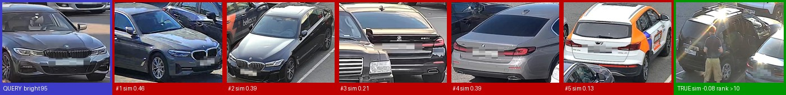
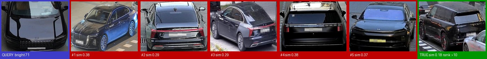
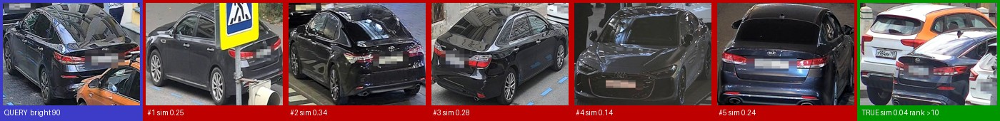

# Error analysis — final pipeline, validation split 42

Produced by `python error_analysis.py runs/val42_final` on the final two-stage pipeline
(`falcon/config_val42.json`, models trained **without** the 300 validation cars). The official answers allow and
recommend doing this on a held-out part of `train.csv`, since the test labels are hidden (#50).

**932 scored queries** (queries of the 50 "stranger" cars have no pair and are excluded, as in the official mAP):
mAP@10 82.25 · Rank-1 78.11 · Rank-5 93.99. The correct car is missing from the top-5 in **56 queries (6.0%)**.

## Why failures happen

In **91% of the failures a wrong car is more similar than the best true match** — the lookalike problem: another
vehicle of the same make, model and colour, often seen from the same angle. Median similarity (stage-1 vectors):
best true match 0.276 vs best wrong match 0.425 in failures; best true match 0.571 in successes. In other words,
when the model fails it is usually because the true photo of the car looks genuinely different (other side,
other light), not because the ranking is noisy.

## Accuracy by condition

| Brightness of the query (0 dark – 255 bright) | mAP@10 | Failure rate |
|---|---|---|
| Q1 darkest (17 – 80) | **0.764** | 8.2% |
| Q2 (80 – 102) | 0.810 | 6.4% |
| Q3 (102 – 124) | 0.856 | 3.9% |
| Q4 brightest (124 – 177) | 0.860 | 5.6% |

| Box area of the query (pixels) | mAP@10 | Failure rate |
|---|---|---|
| Q1 smallest (48,600 – 250,233) | 0.850 | 3.9% |
| Q2 | 0.807 | 6.9% |
| Q3 | 0.799 | 9.4% |
| Q4 largest (444,854 – 1,062,271) | 0.834 | 3.9% |

| True matches in the gallery | Queries | mAP@10 |
|---|---|---|
| 1 | 569 | 0.848 |
| 2 | 262 | 0.757 |
| 3 | 72 | 0.879 |
| 4 | 16 | 0.883 |
| 5–6 | 13 | 0.63 |

Reading: **dark photos are the clearest weakness** (−10 points vs bright). A stronger synthetic night/glare
augmentation was tried and made things worse, so the realistic fix is more real night data. Box size matters
less than expected; the medium sizes are the hardest, likely because they mix views and partial occlusions.

## Typical failure cases (picture grids)

Each grid shows the query, its top-5 and the best true match. Files: `docs/error_analysis/worst_01.jpg` …
`worst_20.jpg` (the 20 worst queries), `summary.txt`, `per_query.csv`.

Patterns found when we reviewed the worst cases (first on the earlier fast model; to be re-checked on these grids):
- **Lookalikes:** same model and colour; the true match is ranked lower because it is seen from the other end
  (front vs rear) or in different light.
- **Front ↔ rear:** the hardest geometry — few shared visible parts.
- **Night and glare:** headlights and reflections hide the body details the model relies on.
- **Label issues in the data:** a few grids look like two different cars sharing one ID, or two cars inside one
  box; we did not remove them from training (not quantified, so not claimed as a number).

## What the model looks at (Grad-CAM)

`docs/gradcam/` (made with `gradcam.py` on a validation ConvNeXt-Base): the heat sits on the car, not the
background; the plate zone stays cold. In a correct rear → front match the model used an orange side sticker
(an instance detail); in a wrong match it relied on the brand logo (brand, not identity). This agrees with the
plate-masking test (no drop with plates painted over).
